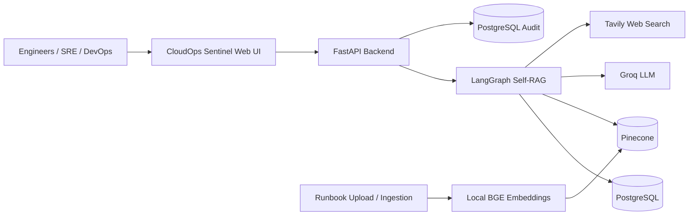
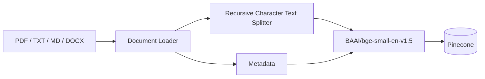

# CloudOps Sentinel

## Self-RAG Incident Response Copilot

> An evidence-grounded AI copilot for cloud operations and incident response that prioritizes private runbooks, evaluates retrieved evidence, verifies generated answers, remembers incident context, and falls back to real-time web search when internal knowledge is insufficient.

**CloudOps Sentinel** combines **FastAPI, LangGraph, Groq, local Hugging Face embeddings, Pinecone, Tavily, and PostgreSQL** into a Self-RAG workflow designed around a practical SRE / DevOps troubleshooting experience.

It is not simply a chatbot over documents. The system decides when retrieval is necessary, evaluates whether retrieved evidence is relevant, rewrites weak queries, falls back to external search when required, checks whether the final answer is supported by evidence, evaluates usefulness, and persists the conversation and audit trail.

---

## Table of Contents

- [Problem](#problem)
- [Solution](#solution)
- [Core Capabilities](#core-capabilities)
- [Architecture](#architecture)
- [Self-RAG Workflow](#self-rag-workflow)
- [Knowledge Ingestion Pipeline](#knowledge-ingestion-pipeline)
- [Answer Grounding and Verification](#answer-grounding-and-verification)
- [Conversation Memory](#conversation-memory)
- [Web Search Fallback](#web-search-fallback)
- [Source Citations and Traceability](#source-citations-and-traceability)
- [Application API](#application-api)
- [Web Interface](#web-interface)
- [Technology Stack](#technology-stack)
- [Project Structure](#project-structure)
- [Design Decisions](#design-decisions)
- [Example Execution](#example-execution)
- [What Makes It Self-RAG](#what-makes-it-self-rag)
- [Current Scope](#current-scope)
- [Future Extensions](#future-extensions)
- [License](#license)

---

## Problem

Cloud and production incidents rarely have a single source of truth.

An engineer may need to combine:

- internal runbooks and SOPs
- deployment procedures
- architecture notes
- postmortems
- previous conversation context
- current external technical guidance

A conventional RAG system generally follows:

```
Question → Retrieve → Generate
```

That approach can fail when retrieval is weak, the query is poorly phrased, the internal knowledge base does not contain the answer, or the generated answer contains claims that are not actually supported by the retrieved evidence.

CloudOps Sentinel addresses these problems by making retrieval, evidence evaluation, query refinement, web fallback, answer verification, and usefulness evaluation explicit parts of the workflow.

---

## Solution

The application follows an evidence-first incident-response pipeline:

```
User Question
     │
     ▼
Conversation Context
     │
     ▼
Retrieval Decision
     │
     ├──────────────► General Knowledge
     │
     ▼
Private Pinecone Retrieval
     │
     ▼
Relevance Grading
     │
     ├── Relevant ───────────────┐
     │                           │
     └── Insufficient             │
             │                   │
             ▼                   │
       Query Rewrite             │
             │                   │
             ▼                   │
       Retry Retrieval           │
             │                   │
             └──── insufficient ─┤
                                 ▼
                         Tavily Web Search
                                 │
                                 ▼
                         Web Evidence Grading
                                 │
                                 ▼
                         Evidence-Based Answer
                                 │
                                 ▼
                          Support Verification
                                 │
                         ┌───────┴───────┐
                         │               │
                     Supported       Unsupported
                         │               │
                         │          Revise Answer
                         │               │
                         └───────┬───────┘
                                 ▼
                         Usefulness Check
                                 │
                                 ▼
                         Final Answer
                                 │
                     ┌───────────┴───────────┐
                     ▼                       ▼
              Source Citations        PostgreSQL Memory
                                      + Audit Trail
```

---

## Core Capabilities

### Evidence-first incident assistance

Answers are grounded in retrieved evidence rather than relying blindly on model knowledge.

### Private knowledge first

The application searches its configured Pinecone knowledge base before using external web search.

### Self-correcting retrieval

When retrieved documents are not relevant enough, the workflow can rewrite the retrieval query and retry.

### Controlled web fallback

If private evidence remains insufficient, the workflow can rewrite the query for web search and use Tavily to obtain external information.

### Answer verification

Generated answers are evaluated against the supplied evidence using a dedicated support check.

### Answer revision

Unsupported or partially supported answers can be revised using the same evidence before being returned.

### Usefulness evaluation

The workflow separately evaluates whether the answer actually addresses the user's question.

### Persistent incident memory

A stable `thread_id` allows follow-up questions to reuse the previous incident conversation through LangGraph's PostgreSQL checkpointer.

### Auditability

Completed interactions are stored in PostgreSQL with:

- question
- answer
- route
- web-search usage
- support status
- usefulness status
- execution trace
- source metadata
- timestamp

### Document ingestion

Operational knowledge can be ingested from:

- PDF
- TXT
- Markdown
- DOCX

### Stable chunk identity

Document chunks receive deterministic identifiers derived from the document name, chunk position, and content hash.

### Source-aware responses

Internal evidence can expose document and page metadata, while web evidence retains its source URL.

---

# Architecture

## High-Level Architecture



### Main components

| Component | Responsibility |
|---|---|
| **Web UI** | Incident conversation, runbook upload, session management, source and trace display |
| **FastAPI** | HTTP API, request validation, file upload, application lifecycle |
| **LangGraph** | Stateful Self-RAG orchestration and conditional routing |
| **Groq** | LLM reasoning, structured decisions, query rewriting, answer generation and verification |
| **Hugging Face BGE** | Local document/query embeddings |
| **Pinecone** | Semantic storage and retrieval of operational knowledge |
| **Tavily** | External web-search fallback |
| **PostgreSQL** | LangGraph conversation checkpoints and RAG audit records |

---

# Self-RAG Workflow

The core implementation lives in `src/self_rag.py`.

## 1. Contextualize the question

The workflow starts with the current user question and the conversation state associated with its `thread_id`.

If the user asks a follow-up such as:

> What should I check next?

the contextualization step can rewrite it into a standalone operational question using the previous conversation.

This prevents follow-up questions from losing the incident context.

---

## 2. Decide whether retrieval is required

The retrieval decision evaluates whether the question requires evidence.

Retrieval is preferred for:

- production incidents
- cloud operations
- infrastructure behavior
- deployment procedures
- troubleshooting
- runbooks
- current or specific technical facts

Generic questions that can safely be answered without external evidence may take the direct-answer path.

When uncertain, the workflow favors retrieval.

---

## 3. Retrieve from the private knowledge base

The application queries the configured Pinecone namespace using the local embedding model.

The current embedding model is:

```
BAAI/bge-small-en-v1.5
Dimension: 384
```

The retriever uses the configured top-k value and returns the most relevant operational chunks.

---

## 4. Grade retrieved evidence

Every retrieved document is independently evaluated for relevance.

The grader asks:

> Does this document contain information useful for answering the question?

The workflow does not require the document to contain the complete final answer. It only needs to provide meaningful evidence for the question.

Irrelevant chunks are discarded.

---

## 5. Rewrite and retry weak retrieval

If the retrieved evidence is insufficient, the workflow can rewrite the internal retrieval query.

The rewritten query:

- preserves service names
- preserves error symptoms
- adds useful operations terminology
- removes unnecessary wording
- is optimized for semantic retrieval

The workflow then returns to Pinecone retrieval.

The number of retrieval rewrites is bounded by configuration.

---

## 6. Fall back to web search

If internal retrieval remains insufficient, the workflow transitions to the external-search path.

The query is rewritten specifically for internet search, including recency wording when the user asks for information such as:

- latest
- current
- today

Tavily then retrieves external results.

---

## 7. Grade web evidence

Web results go through the same relevance-grading mechanism.

Only relevant web evidence is passed forward.

This prevents the system from blindly treating every search result as authoritative context.

---

## 8. Generate the answer

The answer-generation node receives:

- the standalone question
- relevant internal evidence or web evidence
- source metadata

The generation prompt explicitly instructs the model to:

- use supplied evidence
- prefer private operational knowledge when available
- identify external guidance as external
- avoid inventing infrastructure facts
- avoid inventing credentials
- avoid inventing incident history
- provide actionable troubleshooting guidance
- preserve cautions present in the evidence

---

## 9. Verify support

After generation, a separate Self-RAG support evaluator checks whether the important claims in the answer are supported by the evidence.

Possible outcomes:

- `fully_supported`
- `partially_supported`
- `no_support`

The evaluator also records short evidence excerpts.

If the answer is not adequately supported, the workflow can revise it.

---

## 10. Evaluate usefulness

Grounding and usefulness are treated as separate properties.

The usefulness evaluator checks:

> Does this answer actually address the user's question?

Possible outcomes:

- `useful`
- `not_useful`

If the answer is not useful, the workflow can return to retrieval/query refinement, subject to the configured retry limits.

---

## 11. Commit the incident context

The final interaction is committed to the LangGraph PostgreSQL checkpointer.

This allows subsequent questions in the same thread to reuse the incident context.

---

# Knowledge Ingestion Pipeline

CloudOps Sentinel has a dedicated ingestion layer in `src/ingestion.py`.



## Processing stages

### 1. Load

Supported loaders:

- `PyPDFLoader` for PDF
- `TextLoader` for TXT/Markdown
- `python-docx` for DOCX

### 2. Split

Documents are divided using `RecursiveCharacterTextSplitter`.

Current chunk configuration:

- chunk size: **800**
- chunk overlap: **160**

### 3. Attach metadata

Chunks retain metadata such as:

- source
- title
- document name
- page information where available
- chunk index
- knowledge-base namespace

### 4. Generate stable IDs

Chunk IDs are deterministic and based on:

```
document name
+
chunk position
+
content hash
```

This gives the ingestion process stable vector identities instead of generating random IDs for every chunk.

### 5. Embed locally

Embeddings are generated using:

```
BAAI/bge-small-en-v1.5
384 dimensions
```

No embedding API is required for the document vectorization path.

### 6. Store in Pinecone

Vectors and metadata are stored in the configured Pinecone index and namespace.

The same vector-store configuration is used by both ingestion and runtime retrieval.

---

# Answer Grounding and Verification

A key design principle is that **retrieval and verification are different operations**.

A conventional RAG pipeline may stop after:

```
Retrieve → Generate
```

CloudOps Sentinel continues:

```
Retrieve
   ↓
Grade relevance
   ↓
Generate
   ↓
Check support
   ↓
Revise if required
   ↓
Check usefulness
   ↓
Return
```

This makes the system more suitable for operational questions where unsupported instructions can be more dangerous than an explicit inability to answer.

When reliable evidence cannot be found after the configured retrieval and web-search attempts, the system returns a controlled no-evidence response instead of fabricating a troubleshooting procedure.

---

# Conversation Memory

Conversation state is associated with a stable `thread_id`.

The LangGraph PostgreSQL checkpointer stores the workflow state so that a session can continue across multiple questions.

Example:

```text
Engineer:
"Our checkout API is returning 502 errors after deployment.
What should I check first?"

        ↓

CloudOps Sentinel:
Retrieves the relevant deployment/runbook evidence
and produces a grounded response.

        ↓

Engineer:
"What should I check next?"

        ↓

CloudOps Sentinel:
Uses the persisted incident context to understand
what "next" refers to.
```

The memory layer is separate from the RAG audit table:

- **LangGraph PostgreSQL checkpoint** → conversation/workflow state
- **`rag_audit` table** → completed execution and audit information

---

# Web Search Fallback

Tavily is not the first source.

The intended evidence hierarchy is:

```
Private Operational Knowledge
          │
          │ insufficient
          ▼
Query Refinement / Retrieval Retry
          │
          │ still insufficient
          ▼
Tavily Web Search
          │
          ▼
Web Evidence Grading
          │
          ▼
Evidence-Based Answer
```

This distinction is important for enterprise-style incident assistance: organization-specific procedures should come from organization-specific knowledge whenever that knowledge exists.

For questions requiring current external information, the system can transition to the web-search path.

---

# Source Citations and Traceability

Every final response can expose source metadata through the API.

### Internal sources

Internal evidence can contain:

- document title
- source path
- page number

### Web sources

Web evidence can contain:

- title
- source URL

### Execution trace

The Self-RAG graph records execution events such as:

- memory contextualization
- retrieval decision
- internal retrieval count
- relevance grading
- query rewrites
- web-search execution
- answer generation
- support verification
- answer revision
- usefulness evaluation
- memory checkpoint update

The frontend exposes this trace through the **Inspect Self-RAG workflow trace** section.

---

# Application API

The FastAPI application exposes the following implemented endpoints.

| Method | Endpoint | Purpose |
|---|---|---|
| `GET` | `/` | Serve the CloudOps Sentinel web interface |
| `GET` | `/api/health` | Application health information |
| `POST` | `/api/chat` | Execute the Self-RAG incident workflow |
| `POST` | `/api/upload` | Upload and index a supported operational document |
| `GET` | `/api/audits` | Retrieve recent RAG audit records |

### Chat request

The chat API accepts:

```json
{
  "question": "What should I check for a Kubernetes ImagePullBackOff error?",
  "thread_id": "incident-example"
}
```

### Chat response

The response contains:

- answer
- route
- web-search usage
- support status
- usefulness status
- sources
- execution trace
- thread ID
- memory turn count

This makes the API response useful for both the user interface and downstream observability.

---

# Product Walkthrough

The following four figures demonstrate the implemented CloudOps Sentinel experience from the perspective of an on-call engineer. Together, they show the complete interaction lifecycle: starting an incident session, submitting an operational question, running the Self-RAG workflow, and receiving an evidence-grounded response.

The screenshots are stored under `docs/screenshots/` and use repository-relative Markdown paths so they render correctly on GitHub and when the repository is cloned.

## Figure 1 — Incident Response Console

The main console is designed specifically for production incident response rather than generic chat. The interface exposes the Self-RAG stages — **Retrieve, Grade, Verify, and Remember** — alongside the incident session, runbook vault, memory state, response area, sources, and workflow trace.


**What this demonstrates**
- Operator-oriented incident-response UI
- Self-RAG stage visibility
- Private runbook access
- Evidence and source visibility
- Incident memory and audit-oriented workflow

---

## Figure 2 — New Incident Session

A new session creates an isolated incident-memory context. The engineer can begin with a production symptom or use one of the suggested incident prompts. The session provides the `thread_id` boundary used to preserve context across follow-up questions.


**What this demonstrates**
- New incident/session initialization
- Thread-based conversation context
- Starter operational prompts
- Memory-aware investigation workflow

---

## Figure 3 — Self-RAG Execution

While a question is being processed, the interface indicates that the **Self-RAG workflow is running**. The request passes through the retrieval and evaluation pipeline before the final response is produced.


**What this demonstrates**
- Runtime Self-RAG execution
- Retrieval and evidence evaluation
- Conditional workflow orchestration
- Processing state visible to the operator

---

## Figure 4 — Evidence-Grounded Incident Answer

The completed response demonstrates the evidence-first design. The answer is accompanied by source information, the selected route, support status, usefulness status, memory information, and an option to inspect the Self-RAG workflow trace.


**What this demonstrates**
- Evidence-grounded troubleshooting guidance
- Internal runbook source attribution
- **Private Runbooks** routing
- Support verification: **Fully Supported**
- Usefulness verification: **Useful**
- PostgreSQL-backed incident memory
- Inspectable Self-RAG execution trace

> **End-to-end behavior:** An engineer describes an incident → CloudOps Sentinel evaluates whether retrieval is required → private operational evidence is retrieved and graded → weak retrieval can be refined → web search is used only when necessary → the answer is generated and verified → the final response exposes evidence, status, and trace information → incident context is persisted for follow-up questions.

---

# Web Interface

The application includes a dedicated incident-response console rather than a generic chat UI.

## Incident Copilot

Engineers can:

- describe production symptoms
- ask troubleshooting questions
- continue an incident conversation
- start a new incident session
- inspect source information
- inspect the Self-RAG workflow trace

## Runbook Vault

The UI supports uploading:

- PDF
- TXT
- Markdown
- DOCX

Uploaded documents are processed through the same ingestion layer and added to the configured Pinecone knowledge base.

## Evidence visibility

The UI exposes:

- route used
- support status
- usefulness status
- whether internet search was used
- PostgreSQL memory turns
- internal sources
- web sources
- workflow trace

---

# Technology Stack

| Layer | Technology | Role |
|---|---|---|
| **Frontend** | HTML, CSS, JavaScript | Incident-response console |
| **Backend** | FastAPI | REST API and application server |
| **Workflow** | LangGraph | Stateful Self-RAG orchestration |
| **LLM** | Groq / `openai/gpt-oss-120b` | Reasoning, generation and structured decisions |
| **Structured Output** | Groq JSON Schema | Retrieval, relevance, support, usefulness and rewrite decisions |
| **Embeddings** | BAAI/bge-small-en-v1.5 | Local 384-dimensional embeddings |
| **Vector Database** | Pinecone | Private operational knowledge retrieval |
| **Web Search** | Tavily | External information fallback |
| **Persistence** | PostgreSQL | LangGraph checkpoints and audit records |
| **Document Processing** | PyPDF, TextLoader, python-docx | Knowledge ingestion |
| **Application Runtime** | Uvicorn | ASGI server |

---

# Project Structure

```text
CloudOps-Sentinel-Copilot/
│
├── app.py
│   └── FastAPI application, API routes, upload handling and lifecycle
│
├── data_ingestion.py
│   └── Knowledge-base ingestion entry point
│
├── src/
│   ├── config.py
│   │   └── Central application configuration
│   │
│   ├── db.py
│   │   └── PostgreSQL audit persistence
│   │
│   ├── ingestion.py
│   │   └── Document loading, chunking, metadata and vector indexing
│   │
│   ├── models.py
│   │   └── API request/response models
│   │
│   ├── self_rag.py
│   │   └── Complete LangGraph Self-RAG workflow
│   │
│   └── vectorstore.py
│       └── Pinecone + local embedding integration
│
├── documents/
│   ├── checkout-api-runbooks.md
│   ├── deployment-rollback-sop.md
│   └── payments-high-cpu-runbook.md
│
├── docs/
│   ├── architecture_diagram.png
│   ├── CloudOps_Sentinel_Customer_Problem_Statement.pdf
│   └── screenshots/
│       ├── 01-incident-response-console.png
│       ├── 02-new-incident-session.png
│       ├── 03-self-rag-execution.png
│       └── 04-evidence-grounded-answer.png
│
├── templates/
│   └── index.html
│
├── static/
│   ├── app.js
│   └── styles.css
│
├── Self-Rag-Code/
│   └── Step-by-step Self-RAG notebooks and learning artifacts
│
├── requirements.txt
├── .env.example
└── README.md
```

---

# Design Decisions

## 1. Local embeddings instead of an embedding API

The system uses `BAAI/bge-small-en-v1.5` locally for document and query embeddings.

Benefits:

- no separate embedding API dependency
- predictable 384-dimensional vectors
- reduced external calls during retrieval
- keeps the embedding layer independent from the LLM provider

---

## 2. Pinecone for semantic retrieval

Pinecone is responsible for the private operational knowledge base.

The application separates:

- index configuration
- namespace configuration
- embedding generation
- retrieval

This keeps ingestion and runtime retrieval aligned.

---

## 3. Groq for the LLM layer

Groq provides the model inference layer.

The application uses structured JSON Schema outputs for Self-RAG decisions rather than treating every decision as free-form text.

Structured decisions include:

- retrieval decision
- relevance decision
- query rewrite
- support verification
- usefulness evaluation

---

## 4. LangGraph for orchestration

LangGraph is used because the workflow is not a simple linear chain.

The graph contains conditional paths for:

- direct answers
- internal retrieval
- retrieval retries
- web fallback
- answer generation
- support verification
- answer revision
- usefulness retries
- no-evidence termination

This makes the reasoning process explicit and inspectable.

---

## 5. PostgreSQL for state and auditability

PostgreSQL is used for two complementary concerns:

### LangGraph state

Stores conversation/workflow checkpoints associated with `thread_id`.

### RAG audit

Stores completed executions in the `rag_audit` table.

This separates operational memory from execution history.

---

## 6. Evidence before confidence

The system is intentionally designed to prefer:

```
"I do not have enough reliable evidence."
```

over:

```
a confident but unsupported operational instruction
```

That behavior is particularly important for incident-response workflows.

---

# Example Execution

Consider:

> What are the latest recommended troubleshooting steps for Kubernetes ImagePullBackOff?

The workflow can behave as follows:

```text
1. Contextualize question
          ↓
2. Decide retrieval is required
          ↓
3. Search private Pinecone runbooks
          ↓
4. Grade retrieved chunks
          ↓
5. If insufficient → rewrite retrieval query
          ↓
6. Retry internal retrieval
          ↓
7. If still insufficient → prepare web query
          ↓
8. Tavily searches current external sources
          ↓
9. Grade web evidence
          ↓
10. Generate answer from accepted evidence
          ↓
11. Verify answer support
          ↓
12. Revise if unsupported
          ↓
13. Check usefulness
          ↓
14. Return answer + sources + trace
          ↓
15. Persist conversation and audit information
```

The important behavior is that **"latest" can cause the system to require current evidence**, while private runbooks remain the preferred source whenever they contain sufficient information.

---

# What Makes It Self-RAG?

CloudOps Sentinel implements the core Self-RAG idea through explicit self-evaluation and corrective routing.

| Self-RAG behavior | CloudOps Sentinel implementation |
|---|---|
| Decide whether retrieval is necessary | Retrieval decision node |
| Retrieve evidence | Pinecone semantic retrieval |
| Evaluate evidence | Relevance grader |
| Improve weak retrieval | Internal query rewriting |
| Expand beyond private knowledge | Tavily web fallback |
| Evaluate external evidence | Web relevance grading |
| Generate from evidence | Evidence-based generation |
| Check factual support | Support evaluator |
| Correct unsupported output | Answer revision loop |
| Check answer usefulness | Usefulness evaluator |
| Maintain context | LangGraph PostgreSQL checkpoints |
| Explain execution | Workflow trace |
| Preserve source provenance | Internal/web source metadata |

The result is a **closed-loop retrieval and generation workflow**, rather than a single retrieval call followed by generation.

---

# Current Scope

The current implementation focuses on:

- cloud operations questions
- production troubleshooting
- incident-response assistance
- private runbook retrieval
- document ingestion
- Self-RAG evaluation
- web fallback
- conversation memory
- source citations
- execution traces
- PostgreSQL audit logging
- an operator-oriented web interface

The project currently operates as an **AI-assisted decision-support system**. It provides evidence-backed guidance but does not autonomously execute infrastructure remediation actions.

---

# Future Extensions

Potential extensions include:

- Kubernetes and cloud-provider observability integrations
- live incident and alert ingestion
- metrics/log retrieval from operational platforms
- richer incident timelines
- role-based access control
- evaluation datasets and automated RAG quality benchmarks
- stronger production observability
- deployment automation
- human approval workflows for remediation
- incident postmortem generation
- feedback-driven runbook improvement

These are extensions rather than requirements of the current implementation.

---

# Project Philosophy

CloudOps Sentinel is built around four principles:

### **Retrieve before assuming**
Use operational evidence whenever the question benefits from evidence.

### **Evaluate before trusting**
Do not treat retrieved documents or generated answers as automatically correct.

### **Refine before falling back**
Rewrite weak queries and retry retrieval before leaving the private knowledge boundary.

### **Be explicit about uncertainty**
When reliable evidence is unavailable, return a controlled no-evidence response instead of fabricating an operational procedure.

---

## License

This project is licensed under the **MIT License**.
